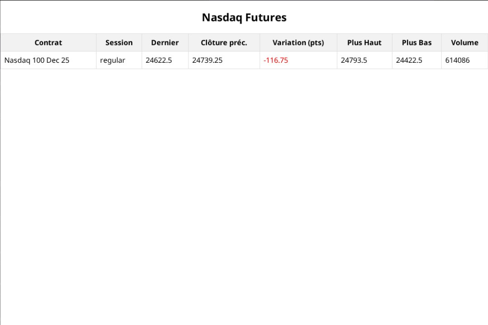

# Nasdaq Daily Brief – Automatisation avec n8n

## Contexte
Suivre l'actualité financière demande du temps.  
Chaque matin, les analystes consultent plusieurs sites pour savoir ce qui s'est passé en Asie et en Europe avant l'ouverture des marchés américains.  
C'est répétitif, chronophage et pas toujours efficace.

## Objectif
Je voulais créer un outil simple.  
Un rapport Nasdaq clair, généré automatiquement, livré tous les jours à **15h00 (heure de Paris)** directement sur **Telegram**.  
Pas de clics, pas de recherches manuelles. Juste l'info essentielle au bon moment.

---

## La solution
J'ai construit un **workflow avec n8n (self-hosted)** qui :  
1. Se déclenche automatiquement à 15h30 grâce à un Cron.  
2. Récupère les données **Nasdaq Futures** via Yahoo Finance (high, low, volume, variation).  
3. Nettoie et organise ces données dans un **rapport HTML**.  
4. Transforme le rapport en **PDF/Image**.  
5. Envoie le tout dans un canal **Telegram privé**.  

---

## Résultat
- Chaque jour, un **rapport uniforme** et lisible est généré sans effort.  
- Les analystes reçoivent un résumé clair **avant l'ouverture US**.  
- Le PDF contient : top movers, variations, volumes et points clés.  

---

## Illustrations
Voici quelques visuels du projet :  

- **Schéma du workflow n8n**  
*(capture ou export depuis n8n)*  

- **Exemple du rapport PDF**  
*(aperçu du tableau généré)*  

- **Message reçu sur Telegram**  
*(screenshot de la notification Telegram)*  

---

## Points intéressants
- Parsing JSON de Yahoo Finance.  
- Différence entre sessions pre-market et régulières.  
- Génération HTML stylisée vers PDF.  
- Notifications automatisées via API Telegram.  

---

## Stack technique
- [n8n](https://n8n.io/)  
- Yahoo Finance API  
- Telegram Bot API  
- HTML → PDF/Image  

---

## Auteur
Projet réalisé par **THIEBAUD**, étudiant en Master 2 Intelligence Artificielle.  
À la recherche d'un **stage de fin d'études (5–6 mois dès février 2026)** sur Paris, Lyon ou Nice.  

---
